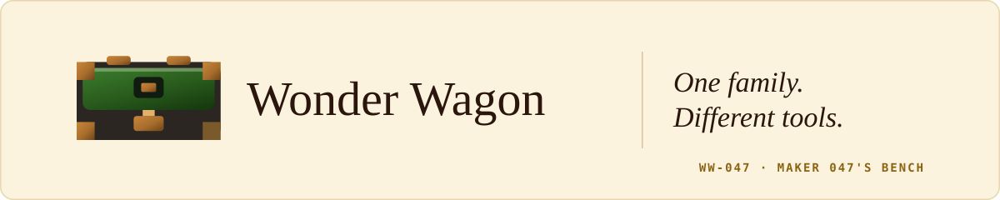
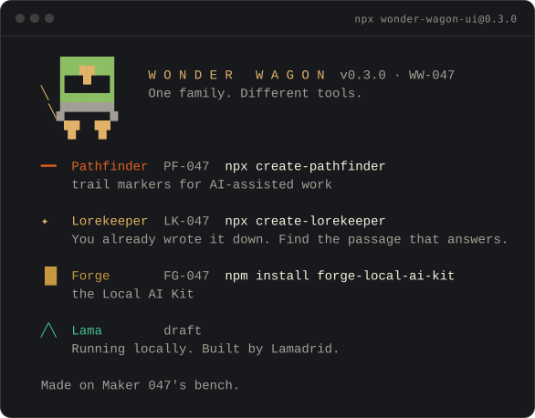

<div align="center">

<picture>
  <source media="(prefers-color-scheme: dark)" srcset="docs/readme/header-night.svg">
  
</picture>

**The small design system behind a family of developer tools.<br>
It standardizes only what real products have proven they share.**

[](https://www.npmjs.com/package/wonder-wagon-ui)
[](https://github.com/rikilamadrid/wonder-wagon-ui/actions/workflows/validate.yml)
[](https://github.com/rikilamadrid/wonder-wagon-ui/actions/workflows/pages.yml)
[](LICENSE)

### [Open the Catalog →](https://rikilamadrid.github.io/wonder-wagon-ui/)

[Storybook](https://rikilamadrid.github.io/wonder-wagon-ui/storybook/) ·
[npm](https://www.npmjs.com/package/wonder-wagon-ui) ·
[Changelog](packages/foundation/CHANGELOG.md) ·
[Releases](https://github.com/rikilamadrid/wonder-wagon-ui/releases) ·
[Contributing](CONTRIBUTING.md)

<sub>by Lamadrid Labs</sub>

<sub>Serial <code>WW-047</code> · the Reference Case on Maker 047's bench</sub>

</div>

## One family. Different tools.

Wonder Wagon is the shared bench behind three released tools — Pathfinder, Lorekeeper
and Forge — and one draft, Lama. Each keeps its own mark, colour, metaphor and job. What
they share is small and has been earned: a terminal identity grammar, a serial scheme, and
the tokens and themes that at least two products actually use.

> One use belongs to the product.
> Two proven uses make it a candidate for Wonder Wagon.

The [**Catalog**](https://rikilamadrid.github.io/wonder-wagon-ui/) is the front door: the
system, the products, their real terminal identities and the release evidence. The
[Storybook laboratory](https://rikilamadrid.github.io/wonder-wagon-ui/storybook/) is
secondary: foundations as specimens, token visualizations and experimental components.

## The family

`npx wonder-wagon-ui` prints the family doorway: the Reference Case riding its pull wagon,
then every sibling with its serial and how to start it.

<p align="center">
  
</p>

<p align="center"><sub>Drawn from the catalog's PTY capture of the published
<code>wonder-wagon-ui@0.3.0</code> at 100 columns, truecolor.</sub></p>

Not every product takes the same amount. Measured at each product's release commit; the
catalog's [Evidence page](https://rikilamadrid.github.io/wonder-wagon-ui/evidence/) has the
numbers.

| Product | Package | Takes from Wonder Wagon | Keeps for itself |
|---|---|---|---|
| [Pathfinder](https://github.com/rikilamadrid/pathfinder) `PF-047` | `create-pathfinder` | Its site's semantic colour layer (34 `--ww-*` declarations, proven against the themes package) and a generated CLI identity. The deepest consumer. | Trail mark, atlascope, Starlight chrome, the diagram renderer |
| [Lorekeeper](https://github.com/rikilamadrid/lorekeeper) `LK-047` | `create-lorekeeper` | A generated family chrome layer (the day/night toggle and serial plate) and a generated CLI identity | The reading-room site: its grounds, ink, type scale and layout as `--lk-*` tokens |
| [Forge](https://github.com/rikilamadrid/forge) `FG-047` | `forge-local-ai-kit` | A generated CLI identity only | Its whole website, Iron night ground (a recorded ruling), web fonts |
| Lama | unreleased, draft | Nothing yet | — |

Pathfinder, Lorekeeper and `wonder-wagon-ui` itself publish through trusted publishing with
npm provenance. Forge follows its documented manual release process and has no provenance
attestation.

## What is public

One package, React-free: [`wonder-wagon-ui`](https://www.npmjs.com/package/wonder-wagon-ui)
(0.x, experimental API).

| Entry | What it is |
|---|---|
| `npx wonder-wagon-ui` | The family doorway: the mark, `WW-047`, and every sibling with how to start it |
| `wonder-wagon-ui/cli` | Build-time generator for dependency-free terminal identity modules that products commit and drift-check |
| `wonder-wagon-ui/tokens/*` | Family tokens as `--ww-*` CSS (layered and unlayered) and DTCG JSON |
| `wonder-wagon-ui/themes/*` | Product themes as CSS and JSON: `wonder-wagon`, `pathfinder`, `lorekeeper`, `forge` |

```sh
npm install --save-dev --save-exact wonder-wagon-ui
```

```css
@import "wonder-wagon-ui/tokens/tokens.css";
@import "wonder-wagon-ui/themes/forge.css";
```

Theme values can change in any 0.x minor: pin an exact version and regenerate anything
you commit from it.

## How products keep their identities

A theme fills six slots (`accent`, `accent-low`, `accent-ink`, `link`, `signal`,
`signal-edge`) plus its enamel, a four-value object radius and a serial. It doesn't touch
grounds, ink, hairlines, focus, depth or space. The contract is narrower than the products,
though: Forge and Lorekeeper own their grounds, and the contract has no slot for that yet.
Hero objects stay in their products.

## What is internal

This repository authors the public files in workspaces that are **not published**:

| Workspace | Role |
|---|---|
| `packages/tokens` (`@wonder-wagon/tokens`) | The token source. CSS, TypeScript, DTCG and the contrast record are generated from one typed file. |
| `packages/themes` (`@wonder-wagon/themes`) | Product themes, the theme contract, adapters, and the Pathfinder and Lorekeeper proofs |
| `packages/ui` (`@wonder-wagon/ui`) | Six React components. **Experimental: no production consumers yet.** Published only once a real product needs them. |
| `packages/foundation` (`wonder-wagon-ui`) | The public package. It re-publishes the token and theme files as static assets. |
| `apps/docs` | The catalog (Astro), with its evidence scripts |
| `apps/storybook` | The laboratory (Storybook 10) |

## How it is tested

- **Types and lint:** type checks and Biome.
- **Contrast:** tokens and themes regenerate in memory and are compared with `dist/`, and
  every declared pairing is measured with the WCAG 2.x formula (66 + 80 pairings, 0 failing).
- **Storybook:** every story runs in Chromium with axe in error mode, and keyboard
  walkthroughs run as play functions.
- **Visual:** committed Playwright snapshots for Storybook and the catalog.
- **Catalog:** axe on every page, day and night, desktop and phone.
- **Catalog links:** every internal link and old Storybook deep link checked.
- **Evidence:** catalog evidence files checked against their manifests.
- **Packaging:** `publint`, `@arethetypeswrong/cli` and size budgets.

The workflows are in [`.github/workflows`](.github/workflows).

## Release and contributing

Changesets, independent versions, `0.x` (a minor can be breaking). Publishing runs through
GitHub Actions with npm trusted publishing. See
[`context/project-overview.md`](context/project-overview.md) and
[`CONTRIBUTING.md`](CONTRIBUTING.md).

## License

MIT. Built with Bun workspaces, TypeScript 7, Astro 7, React 19, Vite 8, Storybook 10,
Vitest 4, Playwright, Biome and Changesets.
